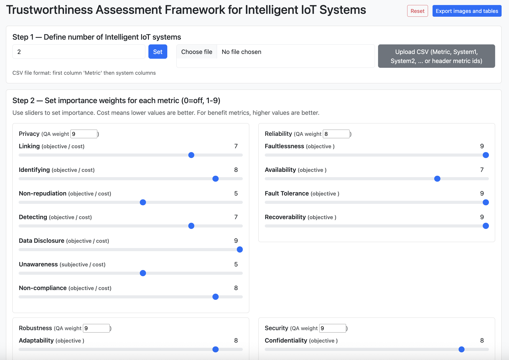
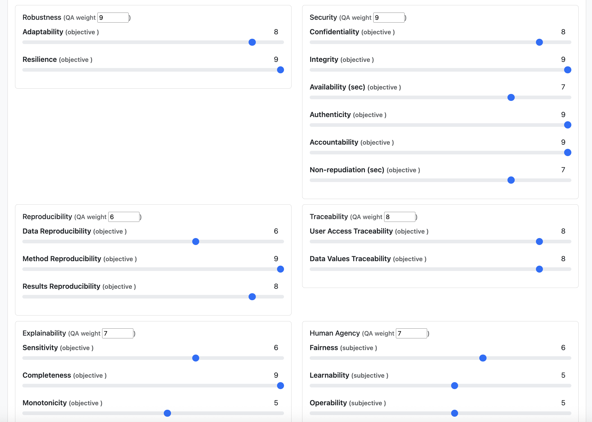
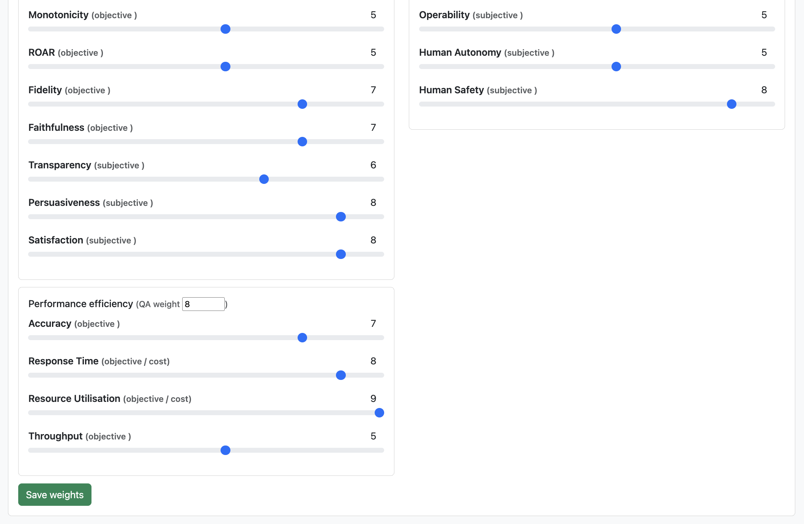
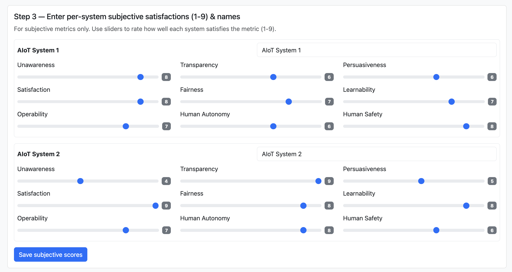
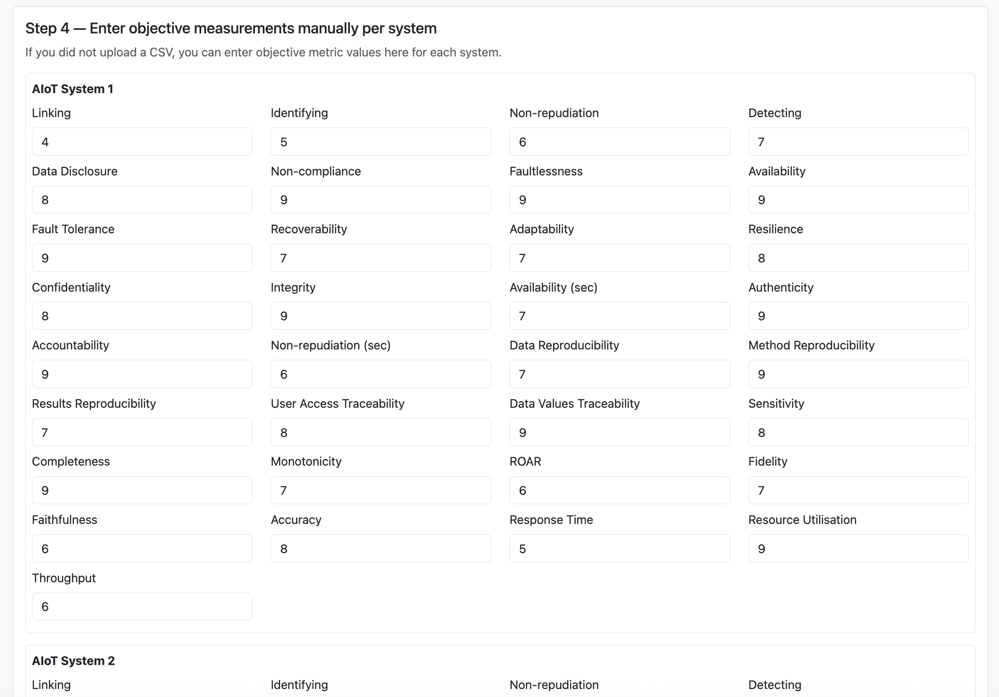
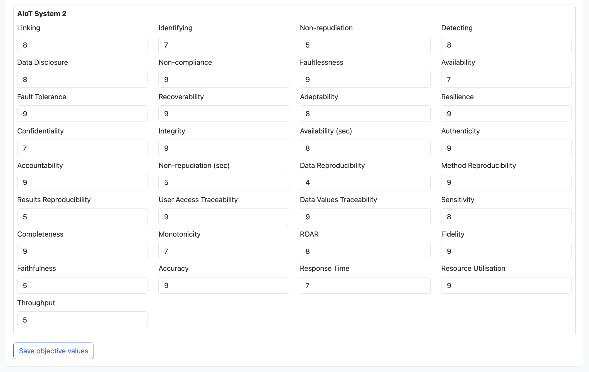
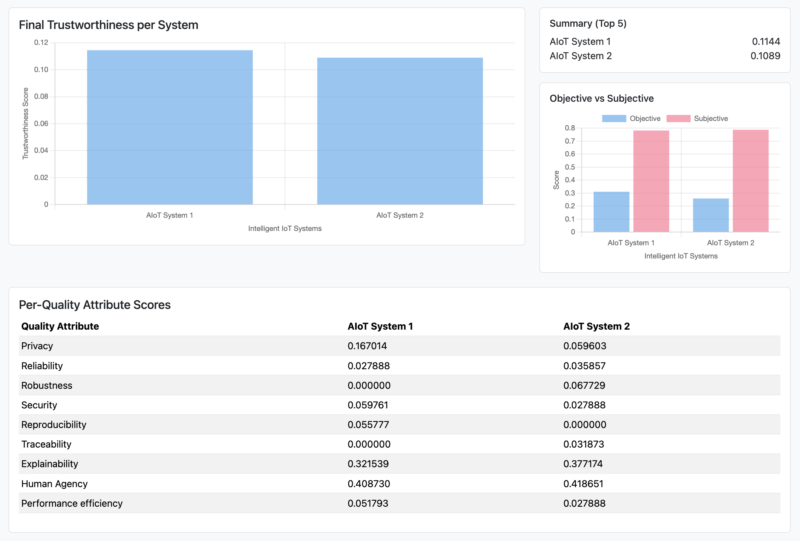

# Trustworthiness Assessment Framework for Intelligent IoT Systems
This repository provides an appendix for our paper titled **An Assessment Method of Trustworthiness of Intelligent IoT Systems**. It includes seven figures, namely Figures 8 to 14, which support our research on the proposed Trustworthiness Assessment Framework for Intelligent IoT Systems.

