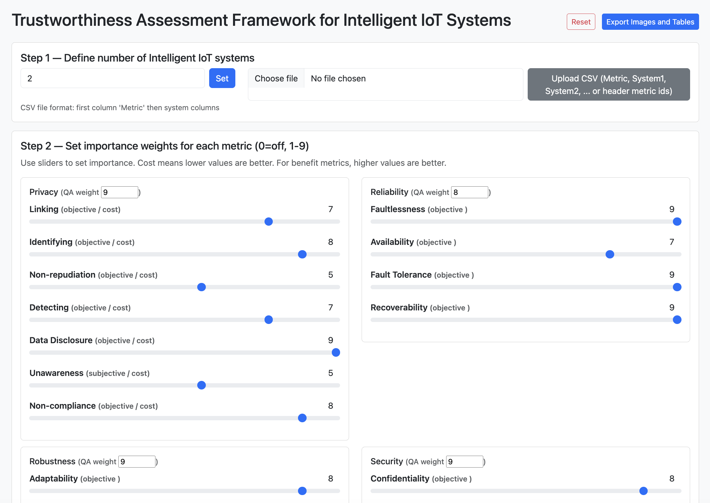
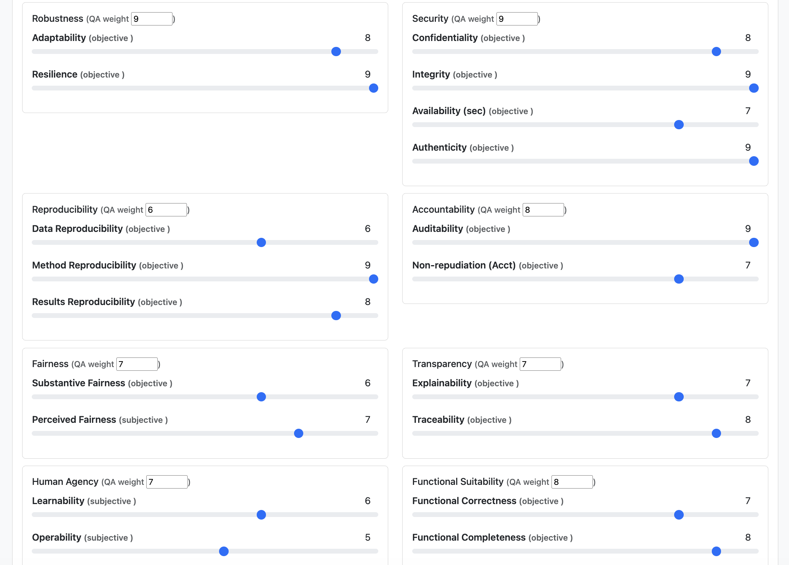
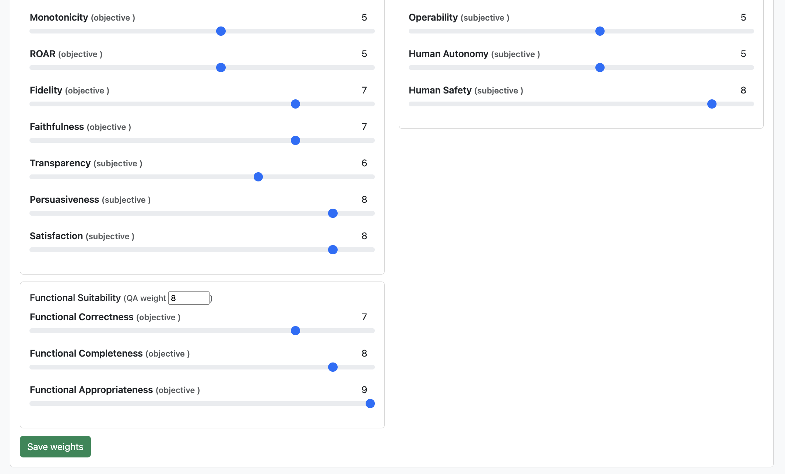
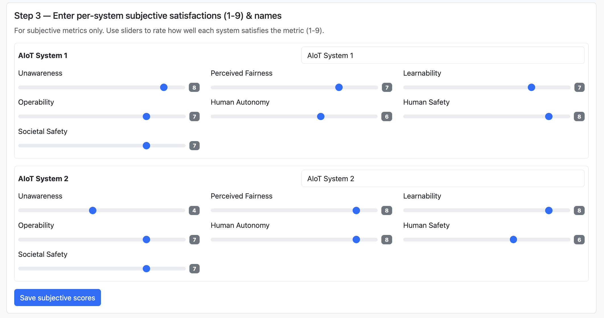
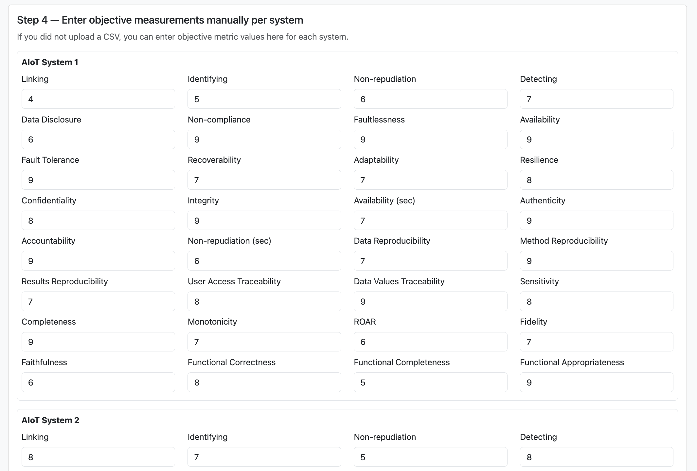
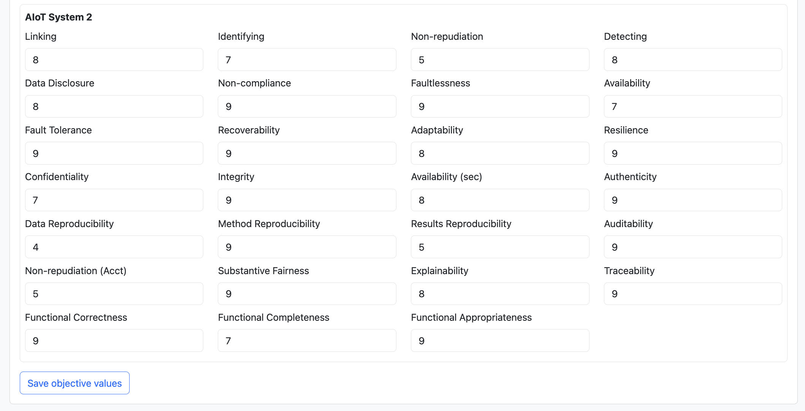
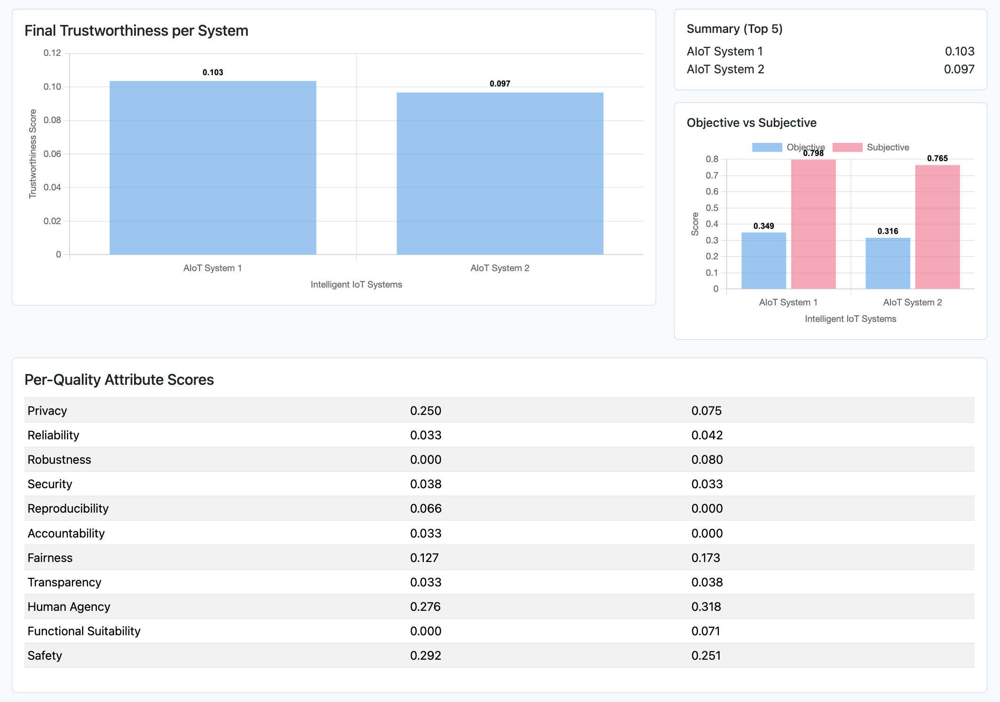

# Trustworthiness Assessment Framework for Intelligent IoT Systems
This repository provides an appendix for our paper titled **A Framework for Assessing Trustworthiness in Intelligent IoT Systems**. It includes seven figures, namely Figures 8 to 14, which support our research on the proposed Trustworthiness Assessment Framework for Intelligent IoT Systems. Click [here](https://link.springer.com/book/10.1007/978-3-032-36590-3) to access the published paper in Springer. The source code for the Framework is available in the **Code** directory and the definitions for the Quality Attributes and Metrics can be found in the **QA-Metrics-Definitions** directory. To run the source code, you need to install PHP webserver such as XAMPP, etc.

Fig. 8: Proposed assessment tool showing smart health use case (page1).

Fig. 9: Proposed assessment tool showing smart health use case (page2).

Fig. 10: Proposed assessment tool showing smart health use case (page3).

Fig. 11: Proposed assessment tool showing smart health use case (page4).

Fig. 12: Proposed assessment tool showing smart health use case (page5).

Fig. 13: Proposed assessment tool showing smart health use case (page6).

Fig. 14: Proposed assessment tool showing smart health use case (page7).

